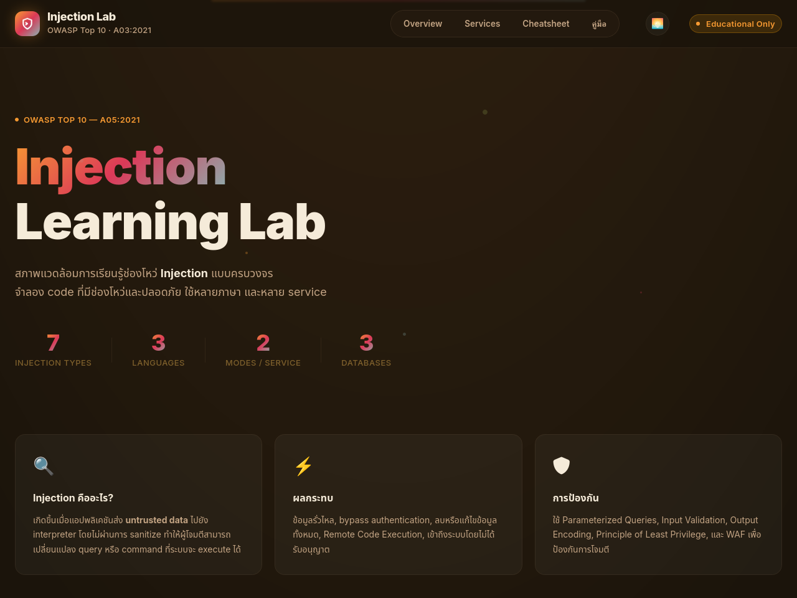
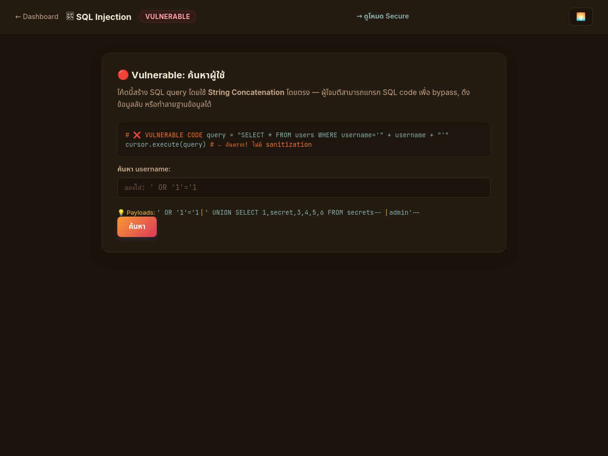

# 🛡️ OWASP A05: Injection Learning Lab

สภาพแวดล้อมการเรียนรู้และทดลองช่องโหว่ **Injection** แบบครบวงจร — จำลองโค้ดที่มีช่องโหว่ (Vulnerable) และแนวทางการแก้ไขที่ปลอดภัย (Secure)
พัฒนาโดยใช้ภาษาที่หลากหลาย (Python, PHP, Node.js) และระบบฐานข้อมูลหลายประเภท (MySQL, MongoDB, OpenLDAP, XML)

> [!WARNING]
> **สำหรับการศึกษาและการทดสอบภายในเท่านั้น** — ห้ามนำเครื่องมือหรือความรู้นี้ไปใช้โจมตีระบบอื่นที่ไม่ได้รับอนุญาตโดยเด็ดขาด

---

## 🎨 ภาพตัวอย่างบอร์ดควบคุม (Lumio Theme)

แดชบอร์ดหลักของโปรเจกต์นี้มาพร้อมกับธีม **Lumio** ที่ให้ความรู้สึกอบอุ่น สบายตา ด้วยโทนสีส้มพระอาทิตย์ตกดิน ผสมผสานกับพื้นหลังโกโก้เข้ม และองค์ประกอบกระจกโปร่งแสง (Glassmorphism)

### 🖥️ Main Dashboard


### 🔍 SQL Injection Exercise


---

## 🚀 เริ่มต้นใช้งานด่วน (Quick Start)

เพื่อให้สามารถรันทุกบริการได้ง่ายที่สุด โปรเจกต์นี้รันผ่าน **Docker Compose**:

```bash
# 1. Clone หรือย้ายโฟลเดอร์เข้ามาในโปรเจกต์
cd /home/zeen/Documents/Injection

# 2. สร้างและเริ่มการทำงานของ Services ทั้งหมด (การสร้างครั้งแรกอาจใช้เวลา 3-5 นาที)
docker-compose up --build -d

# 3. เปิดบราว์เซอร์ของคุณเพื่อเข้าสู่หน้า Dashboard หลัก
# URL: http://localhost:8080

# 4. หากต้องการเปลี่ยนเป็นธีม Lumio ทันที ให้ไปที่:
# http://localhost:8080/?theme=lumio
```

### 🛑 คำสั่งจัดการระบบเพิ่มเติม
- **หยุดการทำงานของระบบชั่วคราว:** `docker-compose down`
- **ลบข้อมูลใน Database และตั้งค่าใหม่ทั้งหมด (Reset Lab):** `docker-compose down -v`

---

## 🌐 ตารางเปรียบเทียบข้อมูลบริการและพอร์ต (Services & Ports)

| บริการ (Service) | พอร์ต (Port) | หน้าทดสอบช่องโหว่ (Vulnerable URL) | ภาษาหลัก / เทคโนโลยี |
| :--- | :---: | :--- | :--- |
| 🎛️ **Dashboard UI** | `8080` | [http://localhost:8080](http://localhost:8080) | HTML / JavaScript / Tailwind CSS |
| 🗄️ **SQL Injection** | `5001` | [http://localhost:5001/vulnerable](http://localhost:5001/vulnerable) | Python (Flask) + MySQL |
| 💻 **Command Injection** | `5002` | [http://localhost:5002/vulnerable.php](http://localhost:5002/vulnerable.php) | PHP + Apache |
| 🍃 **NoSQL Injection** | `5003` | [http://localhost:5003/vulnerable](http://localhost:5003/vulnerable) | Node.js (Express) + MongoDB |
| 📁 **LDAP Injection** | `5004` | [http://localhost:5004/vulnerable](http://localhost:5004/vulnerable) | Python (Flask) + OpenLDAP |
| 📄 **XPath Injection** | `5005` | [http://localhost:5005/vulnerable.php](http://localhost:5005/vulnerable.php) | PHP + XML File |
| 🧩 **Template Injection (SSTI)** | `5006` | [http://localhost:5006/vulnerable](http://localhost:5006/vulnerable) | Python (Flask) + Jinja2 |
| 📦 **XML/XXE Injection** | `5007` | [http://localhost:5007/vulnerable.php](http://localhost:5007/vulnerable.php) | PHP (Libxml2) |

---

## 📚 รายละเอียดช่องโหว่และการทดลองเรียนรู้

ในแต่ละ Module จะแบ่งการทดลองออกเป็น 2 โหมดคือ **Vulnerable Mode** (โค้ดที่มีช่องโหว่) และ **Secure Mode** (โค้ดที่ปิดช่องโหว่แล้ว) เพื่อให้นักเรียนเข้าใจความแตกต่างของโค้ดได้อย่างชัดเจน

### 1. 🗄️ SQL Injection (Port 5001)
* **ปัญหาหลัก:** การใช้ String concatenation หรือการป้อนตัวแปรเข้าไปใน SQL Query โดยตรง
* **ตัวอย่าง Payload:** `' OR '1'='1` หรือ `' UNION SELECT secret FROM secrets--`
* **แนวทางการแก้ไข:** การใช้ parameterized query / prepared statements (`cursor.execute("SELECT * FROM users WHERE username = %s", (user,))`)

### 2. 💻 Command Injection (Port 5002)
* **ปัญหาหลัก:** การส่งค่า Input จากผู้ใช้เข้าไปประมวลผลบนระบบปฏิบัติการ (OS Shell) ผ่านฟังก์ชันเสี่ยง เช่น `shell_exec()`
* **ตัวอย่าง Payload:** `127.0.0.1; cat /etc/passwd`
* **แนวทางการแก้ไข:** การตรวจสอบรูปแบบของตัวแปรก่อนรัน (เช่น `filter_var`) ร่วมกับการใช้ `escapeshellarg()`

### 3. 🍃 NoSQL Injection (Port 5003)
* **ปัญหาหลัก:** ตัวกรองฐานข้อมูลประเภท NoSQL (เช่น MongoDB) ยอมรับการส่ง Query Operators ในรูปแบบออบเจกต์ JSON เข้าไปตรงๆ
* **ตัวอย่าง Payload:** `{"$gt": ""}` หรือ `{"$ne": null}`
* **แนวทางการแก้ไข:** ตรวจสอบ Type ของตัวแปรให้เป็น String เสมอ หรือใช้ไลบรารีช่วยกรอง เช่น `mongo-sanitize`

### 4. 📁 LDAP Injection (Port 5004)
* **ปัญหาหลัก:** การเชื่อมคำค้นหาใน LDAP query Filter ด้วยสตริงปกติ ทำให้แฮกเกอร์เปลี่ยนโครงสร้าง LDAP query ได้
* **ตัวอย่าง Payload:** `*` (เพื่อดูรายชื่อทั้งหมด) หรือ `admin)(&)`
* **แนวทางการแก้ไข:** ใช้การฟิลเตอร์ค่าพารามิเตอร์โดยใช้ฟังก์ชันจาก `ldap3` เช่น `escape_filter_chars()`

### 5. 📄 XPath Injection (Port 5005)
* **ปัญหาหลัก:** การรวบรวม XML query โดยใช้ตัวแปรภายนอกโดยไม่ได้กรองข้อมูล
* **ตัวอย่าง Payload:** `' or '1'='1`
* **แนวทางการแก้ไข:** การใช้ Whitelist Regex Validation ในการจำกัดประเภทตัวอักษร

### 6. 🧩 Server-Side Template Injection (SSTI) (Port 5006)
* **ปัญหาหลัก:** การเรียกใช้ฟังก์ชัน `render_template_string(f"Hello {name}")` ใน Jinja2 ซึ่งอนุญาตให้รันโค้ด Python ในเบื้องหลัง (Remote Code Execution)
* **ตัวอย่าง Payload:** `{{7*7}}` หรือ `{{config.items()}}`
* **แนวทางการแก้ไข:** ใช้ Template variables ในตัวแปรแยกต่างหาก แทนการดึงค่ามาใส่ใน f-string

### 7. 📦 XML External Entity (XXE) (Port 5007)
* **ปัญหาหลัก:** ตัวประมวลผล XML (XML parser) เปิดใช้งาน DTD (Document Type Definition) และ External Entities ไว้
* **ตัวอย่าง Payload:** `<!DOCTYPE data [<!ENTITY xxe SYSTEM "file:///etc/passwd">]>`
* **แนวทางการแก้ไข:** ปิดการทำ DTD โหลด และปิด External Entities ในโปรแกรมอ่าน XML

---

## 📂 โครงสร้างโฟลเดอร์ของโปรเจกต์ (Project Directory Structure)

```text
Injection/
├── docker-compose.yml     # ไฟล์กำหนดและเชื่อมโยงบริการทั้งหมดเข้าด้วยกัน
├── README.md              # คู่มือแนะนำโปรเจกต์
├── assets/                # แหล่งเก็บภาพหน้าจอของโปรเจกต์
│   ├── dashboard_lumio.png
│   └── sqli_lumio.png
├── dashboard/             # เว็บบอร์ดหลัก (Central Hub UI)
│   ├── index.html
│   ├── style.css
│   ├── service-theme.css
│   ├── service-theme.js
│   └── nginx.conf
├── database/              # ไฟล์ตั้งค่าและสคริปต์จำลองข้อมูลตั้งต้น
│   ├── mysql/init.sql
│   └── ldap/bootstrap.ldif
└── services/              # ซอร์สโค้ดของแต่ละแล็บที่มีช่องโหว่
    ├── sql-injection/     # Python Flask + MySQL
    ├── cmd-injection/     # PHP + Apache
    ├── nosql-injection/   # Node.js + MongoDB
    ├── ldap-injection/    # Python Flask + OpenLDAP
    ├── xpath-injection/   # PHP (ดึงข้อมูลผ่าน XML)
    ├── template-injection/# Python Flask (Jinja2 SSTI)
    └── xml-injection/     # PHP (XXE)
```

---

## 🎯 คำแนะนำในการทดลองเรียนรู้ (Learning Flow)

1. เข้าไปที่หน้าบอร์ดหลัก [http://localhost:8080/?theme=lumio](http://localhost:8080/?theme=lumio)
2. เลือกโมดูลช่องโหว่ที่คุณสนใจศึกษา
3. อ่านหลักการและ Cheatsheet/Payload ที่แนะนำในกล่องคำแนะนำ
4. ทดลองโจมตีในโหมดปกติ (**Vulnerable Mode**) ดูผลลัพธ์ที่ได้
5. ศึกษาซอร์สโค้ดในโฟลเดอร์ `services/<ชื่อบริการ>` เพื่อวิเคราะห์หาบรรทัดที่มีข้อบกพร่อง
6. เปลี่ยนหน้าจอเป็นโหมดปลอดภัย (**Secure Mode**) และทดลองใช้ Payload เดิมดูผลตอบสนองของระบบ
7. สังเกตและทำความเข้าใจแนวทางการเขียนโค้ดที่ถูกต้องเพื่ออุดช่องโหว่ดังกล่าว

---

## 📖 แหล่งข้อมูลเพิ่มเติม (References)
* [OWASP Top 10 A03:2021 - Injection](https://owasp.org/Top10/A03_2021-Injection/)
* [OWASP Injection Prevention Cheat Sheet](https://cheatsheetseries.owasp.org/cheatsheets/Injection_Prevention_Cheat_Sheet.html)
* [OWASP SQL Injection Prevention Cheat Sheet](https://cheatsheetseries.owasp.org/cheatsheets/SQL_Injection_Prevention_Cheat_Sheet.html)
* [OWASP XXE Prevention Cheat Sheet](https://cheatsheetseries.owasp.org/cheatsheets/XML_External_Entity_Prevention_Cheat_Sheet.html)
